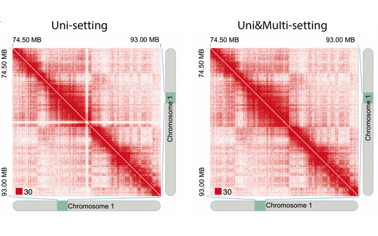

# mHi-C: robust leveraging of multi-mapping reads in Hi-C analysis
Ye Zheng, Ferhat Ay, and Sunduz Keles. "mHi-C: robust leveraging of multi-mapping reads in Hi-C analysis." bioRxiv (2018): 301705.

The pipeline is developed in Keles Research Group in University of Wisconsin - Madison and please contact Ye Zheng (yezheng@stat.wisc.edu) for any question and suggestion.

## What is mHi-C?
mHi-C is short for **m**ulti-mapping strategy for **Hi-C** data in order to make use of reads aligned to multiple positions. mHi-C pipeline was developed to incorporate multi-mapping reads starting from unaligned read files and produces a set of statistically significant contacts at a give resolution. Remarkably, each main step is organized into independent script with flexible user-defined parameters and implementation options. Therefore, analysis can be carried out from any step of the work-flow and easily fits in high performance computing enviroments for parallel computations.



## mHi-C main procedures

### Step 0 - Pipeline caller [mhic_step0-6.sh]
Caller for all the steps in mHi-C pipeline, starting from raw data (fastq files) downloading to alignment and eventually to assign alignment probability to multi-reads. Before digging into the details of the pipeline, mhic_step0-6.sh offers a complete demo run using small but real Hi-C data ([Plasmodium falciparum genome Trophozoites stage](https://noble.gs.washington.edu/proj/plasmo3d)). What you need to prepare is to install 1. BWA, 2. samtools, 3. python3 with corresponding modules required in each step, 4. set the path of $projectPath, $bwaDir, $samtoolsDir accordingly. Parameters in the script have been set for the demo data but can always be customized for you own use.

Now are you ready to try mHi-C? git clone this repository, as there are useful data and scripts under the bin/, and try the following single command! All the steps, 0 to 6, should be finished within 1 or 2 hours (for the demo) depending on your computing resources. :)

#### 0.0 Usage

```
bash mhic_step0-6.sh
```

### Step 1 - Alignment [s1_bwaAlignment.sh]
Default aligner is BWA but other aligner such as bowtie can also be used as long as it records multi-mapping reads related alignment information. Besides, chimeric reads are rescued in this step.

#### 1.0 Requirements
- BWA (>=0.5.9)
- samtools (>=1.3)

#### 1.1 Arguments

```
1. name         : Name of the input fastq file. Hi-C reads are paired-end reads stored in a paired fastq files, for example, IMR90_primaryReplicate_1.fastq and IMR90_primaryReplicate_2.fastq. The name should be "IMR90_primaryReplicate".
2. ref          : Reference genome file including the path to it. For example, "/projects/ReferenceGenome/PlasmoDB-9.0_Pfalciparum3D7_Genome.fasta".
3. bwaDir       : Path to BWA aligner. For example, "/projects/Softwares/bwa-0.5.9".
4. samtoolsDir  : Path to samtools. For example, "/projects/Softwares/samtools-1.3".
5. fastqDir     : Path to the fastq files.
6. resultsDir   : Path to the output results including the intermediate files. 
7. bin          : Path to the bin folder where cutsite_trimming_mHiC.cpp can be found.
8. core         : Number of threads for parallel alignment.
9. cutsite      : Restriction enzyme cutting site. For example, "AAGCTAGCTT" for HindIII and "GATCGATC" for MboI.
10. seqLength   : [Optional] The minimum read length for chimeric reads. >=25 is enforced by mHiC.
11. summaryFile : [Optional] Name for the alignment summary file. By default, "mHiC.summary" will be used as the summary file name.
12. saveFiles	: [Optional] Save the intermediate files. 1: save; 0: do not save. By default, it will be 1.
```

#### 1.2 Usage

```
name="TROPHOZOITES"
ref="$projectPath/bin/PlasmoDB-9.0_Pfalciparum3D7_Genome.fasta"
bwaDir="$projectPath/Softwares/bwa-0.5.9" ## need downloading bwa software
samtoolsDir="$projectPath/Softwares/samtools-1.3" ## need dowloading samtools software
fastqDir="$projectPath/fastqFiles"
resultsDir="$projectPath/$name"
bin="$projectPath/bin"
nCores=8
cutsite="GATCGATC" ## for MboI ##"AAGCTAGCTT" for HindIII
seqLength=25
resolution=10000
saveFiles=0

## compile cutsite to trim chimeric reads
g++ -std=c++0x -o $bin/cutsite_trimming_mHiC $bin/cutsite_trimming_mHiC.cpp

## generate reference genome bwa index
$bwaDir/bwa index $ref


## alignment
echo "Start step 1 - alignment!"
bash s1_bwaAlignment.sh "$name" "$ref" "$bwaDir" "$samtoolsDir" "$fastqDir" "$resultsDir/s1" "$bin" "$nCores" "$cutsite" "$seqLength" "$resultsDir/mHiC.summary_w${resolution}_s1" "$saveFiles"
```

### Step 2 - Read ends pairing [s2_joinEnd.py] 
In step 1, two ends (_1.fastq and _2.fastq) are aligned separetely to the reference genome which can be paired by read ID. Thus paired-end reads can be formed and each paired-end read represent one interaction.

#### 2.0 Requirements
- python (>= 3.6)
- numpy (>= 1.13.1)
- scipy (>= 0.19.1)
- pysam (>= 0.12.0)


#### 2.1 Arguments

```
readEnd1	(-r1/--readEnd1)	    : Path to the aligned file of read end 1.
readEnd2	(-r2/--readEnd2)	    : Path to the aligned file of read end 2.
output		(-o/--output)		    : Path to the aligned paired-end file.
summary		(-s/--summary)		    : [Optional] Summarize alignment results, i.e. number of unmapped reads, singleton and mapped reads, etc. Default is true.
summaryFile	(-sf/--summaryFile)	    : [Optional] Path to the summary file including the summary file name. Default is alignedFileName.alignSummary
verbose		(-v/--verbose)		    : [Optional] Verbose. Default is true.

```

#### 2.2 Usage
```
name="TROPHOZOITES"
resultsDir="$projectPath/$name"
resolution=10000

echo "Start step 2 - joining read ends!"
python3 s2_joinEnd.py -r1 ${resultsDir}/s1/${name}_1.sam -r2 ${resultsDir}/s1/${name}_2.sam -o ${resultsDir}/s2/${name}.sam -sf $resultsDir/mHiC.summary_w${resolution}_s2
```


### Step 3 - Valid fragment filtering [s3_categorizePairs.py]
This step is to ensure valid read pairs are passed on to downstream analysis while excluding dangling end, self circle, religation, too short-range interactions as well as  invalid alignment that are far away from restriction enzyme cutting sites. Read pairs in each category are summarized.

#### 3.0 Requirements
- python (>= 3.6)
- numpy (>= 1.13.1)
- scipy (>= 0.19.1)
- pysam (>= 0.12.0)
- bx-python (>= 0.5.0)

#### 3.1 Arguments

```
fragment	(-f/--fragment)		: Restriction Enzyme(RE) fragment file.
read		(-r/--read)		: Paired-ended read alignment file from step 2.
outdir		(-o/--outdir)		: Output directory to save category results.
lower		(-l/--lower)		: Lower bound of the read pair distances summation from read end alignment position to its assigned RE fragment cutting site. Default value is None indicating no restriction. Recommended 50.
upper		(-u/--upper)		: Upper bound of the read pair distances summation from read end alignment position to its assigned RE fragment cutting site. Default value is None indicating no restriction. Recommended 500.
distance	(-d/--distance)		: Minimum distance between intrachromosomal read pair alignments positions. Default value is None indicating no restriction. Recommended 20k or two times the resolution.
binMethod	(-m/--method)		: Binning methods: by fixed number of window size, i.e. window, or fixed number of RE fragment, i.e. fragment. By default, binning by window is utilized.
resolution	(-b/--bin)		: Binning resolution. If binning by fixed number of window size, it can be 10000 or any other suitable bin size. If binning by fixed number of RE fragment, it can be 10 representing 10RE fragments or other suitable bin size.
summary		(-s/--summary)		: [Optional] Summarize the categories of read pairs. Default is true.
summaryFile	(-sf/--summaryFile)	: [Optional] Path to the summary file including the summary file name. Default is alignedFileName.readCategorySummary.
verbose		(-v/--verbose)		: [Optional] Verbose. Default is true.
```

#### 3.2 Usage

```
name="TROPHOZOITES"
resultsDir="$projectPath/$name"
bin="$projectPath/bin"
refrag="MboI_resfrag.bed" #restriction fragment file
resolution=10000
lowerBound=$((resolution * 2))
refragL=50 #$((seqLength * 2))
refragU=500

echo "Start step 3 - categorize read pairs!"
python3 s3_categorizePairs.py -f ${bin}/${refrag} -r ${resultsDir}/s2/${name}.sam -o ${resultsDir}/s3 -l $refragL -u $refragU -d $lowerBound -m "window" -b $resolution -sf $resultsDir/mHiC.summary_w${resolution}_s3
```

#### 3.3 Input file - Restriction enzyme fragment (BED file), i.e, digest genome
HiCPro provides scripts and detailed way to generate such files ([http://nservant.github.io/HiC-Pro/UTILS.html#digest-genome-py](http://nservant.github.io/HiC-Pro/UTILS.html#digest-genome-py)).
```
chr1    0       16007   HIC_chr1_1      0       +
chr1    16007   24571   HIC_chr1_2      0       +
chr1    24571   27981   HIC_chr1_3      0       +
chr1    27981   30429   HIC_chr1_4      0       +
chr1    30429   32153   HIC_chr1_5      0       +
chr1    32153   32774   HIC_chr1_6      0       +
chr1    32774   37752   HIC_chr1_7      0       +
chr1    37752   38369   HIC_chr1_8      0       +
chr1    38369   38791   HIC_chr1_9      0       +
chr1    38791   39255   HIC_chr1_10     0       +
chr1    39255   43602   HIC_chr1_11     0       +
```


### Step 4 - Duplicates removal and genome binning [s4_bin.sh]
Remove the PCR duplicates and bin the genome by fixed window size.

#### 4.0 Requirements
- python (>= 3.6)
- numpy (>= 1.13.1)

#### 4.1 Arguments

```
1. validP		: Path to the valid read pairs obtained from step3.
2. validI	      	: Path to the output non-duplicated valid interactions. Users can take this chance to rename the interaction files otherwise users can set it to be the same as validP
3. bin		      	: Path to the bin folder where ICE normalization script can be found.
4. resolution		: Binning resolution. For example 10000.
5. minCount	      	: Minimum contact counts of the bin pairs considered. Default is 1.
6. normMethod		: Contact matrix normalization method. Options are ICE, KR and None, i.e., not implement any normalization procedure on contact matrix. See more in 4.3 for discussion of the normalization methods. By defualt, ICE is utilized.
7. mappFile	      	: Path to the mappability file required by ICE method. It can be set to "" or any value if KR or None is select for normalization method.
8. minMapp	      	: Minimum mappability of the regions considered which is required by ICE method. It can be set to "" or any other value if KR or None is select for normalization method. Default is 0.5.
9. maxInter	      	: Maximum iteraction of ICE to normalize contact matrix required by ICE method. It can be set to "" or any other value if KR or None is select for normalization method. Default is 100.
10. chromSizeFile	: Chromosome size file required by KR method. It can be set to "" or any other value if ICE or None is selected for normalization method.
11. sparsePerc		: Percentage of sparse regions, i.e., regions that have 0 or low interactions. It is required by KR normalization approach and can be set to "" or any other value if ICE or None is utilized for normalization. Default is 5 for 5%.
12. summaryFile	      	: Summary file name. Default is rmDuplicates.summary.
13. splitByChrom	: To remove duplicates, sorting by chrom + position + strand is needed. For high resolution and deeply sequenced Hi-C data, it may require extremely large memory for the sorting procedure. Spliting by chromosome will alleviate the memory demand and can potentially be much faster. For smaller genome or lower resolution, splitting by chromosome is actually not necessary. 1: split; 0: not split. By default, it will be 1.
14. saveSplitContact  	: Save the splitting interactions files. 1: save; 0: do not save. By default it will be 0.
15. chrList		: An array of chromosome number. For example for human, it can be ($(seq 1 22) X Y). If the chromosomes start with "chr", you can just put in the array of chromosome number, such as chrList=(1 2 3) or chrList=($(seq 1 22) X Y). If not, the prefix and chromosome number should be both given, such as chrList=(chromosome1 chromosome2 chromosome3) or it can be generated by chrList=(chromosome{1..22}). Such chromosome names should be consistent with those in reference genome in step1 (alignment) and the chromosome size file for KR normalization ($chromSizeFile).


```
#### 4.2 Usage

```
name="TROPHOZOITES"
resultsDir="$projectPath/$name"
resolution=10000
bin="$projectPath/bin"
validP="${resultsDir}/s3/${name}.validPairs"
validI="${resultsDir}/s4/${name}.validPairs"
minCount=1 #min contact counts allowed

normMethod="KR" #1. "ICE" 2. "KR" 3."None"
ICEmappFile="${bin}/pfal3D7.MboI.w${resolution}" ## mappability file for ICE method
ICEminMap=0.5 ## min mappability threshold for ICE method
ICEmaxIter=150 ## maximum number of iteration for ICE method
KRchromSizeFile=${bin}/plasmodium.chrom.sizes ## chromosome size file for KR method
KRsparsePerc=5 ## remove *% of sparse regions for KR method
splitByChrom=1
saveSplitContact=0
chrList=$(seq 1 14)


echo "Start step 4 - duplicates removal and binning!"
bash s4_bin.sh "$validP" "$validI" "$bin" "$resolution" "$minCount" "$normMethod" "$ICEmappFile" "$ICEminMap" "$ICEmaxIter" "$KRchromSizeFile" "$KRsparsePerc" "$resultsDir/mHiC.summary_w${resolution}_s4" "$splitByChrom" "$saveSplitContact" "${chrList[@]}"
```
#### 4.3 Normalization methods

* ICE	   : Iterative Correction and Eigenvector decomposition algorithm. (Imakaev, Maxim, et al. "Iterative correction of Hi-C data reveals hallmarks of chromosome organization." Nature methods 9.10 (2012): 999.)
             ICE offers function to remove extreme low mappability regions therefore mappability for each bin is needed. The format of mappability file is given in 4.4 and it can be generated by GEM-mappability ([guide](https://wiki.bits.vib.be/index.php/Create_a_mappability_track)).

* KR   	   : Knight-Ruiz normalization algorithm. (Knight, Philip A., and Daniel Ruiz. "A fast algorithm for matrix balancing." IMA Journal of Numerical Analysis 33.3 (2013): 1029-1047.)
             KR method is much faster for high resolution (e.g. 1kb, 5kb) and deeply sequenced samples.

* None	   : The fastest approach as no normalization is implemented and the prior will be built on the raw contact matrix.
  	     Utilizing normalized contact matrix will lead to a better prior constructed in step 5 and will end up having a stronger power to distinguish multi-reads potential alignment positions.

#### 4.4 Input file - mappability file

```
chrom	midPoint	anything	mappabilityValue	anything
chr1    20000   10      0.003775        0.526966666667
chr1    60000   8       0.01415 0.358675
chr1    100000  19      0.013   0.3898
chr1    140000  12      0.0008  0.4595
chr1    180000  4       0.0008  0.450192340816
chr1    220000  7       0.000575        0.402765636176
chr1    260000  13      0.004275        0.386305422274
chr1    300000  1       0.0     0.450679526523
chr1    340000  16      0.00055 0.421625
chr1    380000  10      0.000225        0.3797
chr1    420000  14      0.000575        0.44275
chr1    460000  10      0.0007  0.467705942362
chr1    500000  0       0.0     0
chr1    540000  13      0.007025        0.501630772417
chr1    580000  13      0.01005 0.39495
chr1    620000  10      0.0029  0.38705
```

### Step 5 - mHi-C generative model prior building [s5_prior.py]
Build the prior for mHi-C model using uni-reads only.

#### 5.0 Requirements
- python (>= 3.6)
- numpy (>= 1.13.1)
- scipy (>= 0.19.1)
- sklearn (>= 0.19.1) 

#### 5.1 Arguments

```
fragment	(-f/--fragments)	    : Marginal bin list of all the interactions. Midpoints of each fragment is utilized.
interaction	(-i/--interactions)	    : Interaction files of uni-reads normalized by ICE in step 4.
outdir		(-o/--outdir)		    : Path to save outputs.
splineBin	(-b/--noOfBins)	    	    : Number of equal-occupancy bins. Default is 100.
priorName	(-l/--lib)		    : Name of file that save the prior quantifying the relationship between random contact probability and genomic distances	.
```

#### 5.2 Usage

```
name="TROPHOZOITES"
resultsDir="$projectPath/$name"
resolution=10000
validI="${resultsDir}/s4/${name}.validPairs"
splineBin=150
priorName="uniPrior"
normMethod="KR" #"ICE" ##"KR"

if [ "$normMethod" != "None" ] && [ "$normMethod" != "" ] && [ "$normMethod" != "NONE" ] && [ "$normMethod" != "none" ]; then
    contactFile=$validI.binPairCount.uni.${normMethod}norm
else
    contactFile=$validI.binPairCount.uni
fi

echo "Starts step 5 - prior construction based on uni-reads only!"
python3 s5_prior.py -f $validI.binPair.Marginal -i $contactFile  -o ${resultsDir}/s5 -b $splineBin -l $priorName
```

### Step 6 - mHi-C assigning multi-reads [s6_em.py]
In this step, allocation probabilities are assigned to each multi-mapping reads at each potential alignment position. s6_em_cython.pyx will be called to accelerate computation process.

#### 6.0 Requirements
- python (>= 3.6)
- pyximport

#### 6.1 Arguments

```
prior		(-p/--prior)		: Prior built in step 5.
uniCount	(-u/--uni)		: Uni-reads bin-pair contact count file.
multiBinPair	(-m/--multi)		: Multi-reads contact file.
multiKeys	(-mk/--multikeys)	: Multi-reads contact bin keys.
threshold	(-t/--threshold)	: Multi-reads contact probability threshold to extact high quality multi-mapping contact.
filename	(-f/--filename)		: Multi-reads contact posterior probability assignment output file name. ".mHiC" will be added as suffix.
outdir		(-o/--outdir)		: Output directory to save results.
verbose		(-v/--verbose)		: [Optional] Verbose. Default is true.
```

#### 6.2 Usage

```
name="TROPHOZOITES"
resultsDir="$projectPath/$name"
resolution=10000
prior="${resultsDir}/s5/splineResults"
multi="${resultsDir}/s4/${name}.validPairs.MULTI.binPair.multi"
multiKeys="$resultsDir/s4/${name}.validPairs.MULTI.binPair.multiKeys" 
uni="$resultsDir/s4/${name}.validPairs.binPairCount.uni"
filename="${name}.validPairs.binPair.multi"
threshold=0.5

echo "Starts step 6 - assign probability to multi-reads potential alignment positions !"
awk -v OFS="_" '{print $2, $3, $4, $5}' $multi | sort -u >$multiKeys
python3 s6_em.py -p $prior -u $uni -m $multi -mk $multiKeys -t $threshold -o "${resultsDir}/s6" -f $filename
```

#### 6.3 Input file - Uni-reads bin-pair contact count file
```
chr1    20000   chr3    196460000       1
chr1    20000   chrX    155260000       1
chr1    60000   chr2    199340000       1
chr1    60000   chr4    84780000        1
chr1    60000   chr4    164380000       1
chr1    60000   chr7    2340000 1
chr1    60000   chr7    11700000        2
chr1    60000   chr7    29940000        2
chr1    60000   chr7    34460000        1
chr1    60000   chr7    45340000        1
chr1    60000   chr8    98140000        1
chr1    60000   chr8    131860000       1
chr1    60000   chr11   107220000       1
chr1    60000   chr13   34220000        1
chr1    60000   chr13   102580000       1
```

Multi-reads contact file
```
HWI-ST216_0180:3:1204:18475:195018      chr10   60000   chrX    42260000
HWI-ST216_0283:7:2102:4063:178540       chr10   60000   chr11   96940000
HWI-ST216_0283:7:2206:17601:52440       chr10   60000   chr11   96940000
HWI-ST216_0283:7:2102:4063:178540       chr10   60000   chr11   97620000
HWI-ST216_0283:7:2206:17601:52440       chr10   60000   chr11   97620000
HWI-ST216_0283:7:2102:4063:178540       chr10   60000   chr12   103860000
HWI-ST216_0283:7:2206:17601:52440       chr10   60000   chr12   103860000
HWI-ST216_0283:7:2102:4063:178540       chr10   60000   chr12   48780000
HWI-ST216_0283:7:2206:17601:52440       chr10   60000   chr12   48780000
HWI-ST216_0283:7:2102:4063:178540       chr10   60000   chr12   74860000
HWI-ST216_0283:7:2206:17601:52440       chr10   60000   chr12   74860000
HWI-ST216_0283:7:2102:4063:178540       chr10   60000   chr18   23340000
HWI-ST216_0283:7:2206:17601:52440       chr10   60000   chr18   23340000
HWI-ST216_0283:7:2102:4063:178540       chr10   60000   chr18   20000
HWI-ST216_0283:7:2206:17601:52440       chr10   60000   chr18   20000
HWI-ST216_0283:7:2102:4063:178540       chr10   60000   chr19   23780000
HWI-ST216_0283:7:2206:17601:52440       chr10   60000   chr19   23780000
HWI-ST216_0283:7:2102:4063:178540       chr10   60000   chr20   19260000
HWI-ST216_0283:7:2206:17601:52440       chr10   60000   chr20   19260000
HWI-ST216_0283:7:2102:4063:178540       chr10   60000   chrX    104900000
HWI-ST216_0283:7:2206:17601:52440       chr10   60000   chrX    104900000
HWI-ST216_0283:7:2102:4063:178540       chr10   60000   chrX    115100000
```

#### mHi-C outcome: probability assignment to all the potential alignment positions for each multi-reads
```
HWI-ST279:283:D1ACDACXX:8:1101:1345:16298       chr11   1955000 chr4    1155000 0.04448364631169624
HWI-ST279:283:D1ACDACXX:8:1101:1345:16298       chr11   45000   chr11   1955000 0.5951475510998886
HWI-ST279:283:D1ACDACXX:8:1101:1345:16298       chr7    35000   chr11   1955000 0.36036880258841525
HWI-ST279:283:D1ACDACXX:8:1101:1345:54161       chr8    455000  chr4    945000  0.2559876018501595
HWI-ST279:283:D1ACDACXX:8:1101:1345:54161       chr8    455000  chr4    965000  0.7440123981498405
HWI-ST279:283:D1ACDACXX:8:1101:1352:20204       chr10   1655000 chr9    15000   0.1673993168315729
HWI-ST279:283:D1ACDACXX:8:1101:1352:20204       chr3    1045000 chr9    15000   0.14897657449274118
HWI-ST279:283:D1ACDACXX:8:1101:1352:20204       chr9    15000   chr8    1445000 0.6836241086756858
HWI-ST279:283:D1ACDACXX:8:1101:1359:95492       chr10   1615000 chr4    945000  0.21741198606305115
HWI-ST279:283:D1ACDACXX:8:1101:1359:95492       chr10   1615000 chr4    955000  0.01489117401888037
HWI-ST279:283:D1ACDACXX:8:1101:1359:95492       chr6    35000   chr4    945000  0.7337329633658197
HWI-ST279:283:D1ACDACXX:8:1101:1359:95492       chr6    35000   chr4    955000  0.033963876552248806
```

### Step 7 - Significant contacts detection [Fit-Hi-C]

Fit-Hi-C pipeline: https://github.com/ay-lab/fithic

### bin/
Other necessary scripts and supplementary data can be found there. 

* cutsite_trimming_mHiC.cpp : utilized to trim unmapped reads to save chimeric reads.
* ICE-with-sparseMatrix.py : script for ICE normalization.
* KR_norm_mHiC.py : script for KR normalization.
* PlasmoDB-9.0_Pfalciparum3D7_Genome.fasta: reference genome.
* pfal3D7.MboI.w10000, human-hg19.HindIII.w300000, human-hg19.HindIII.w40000, hg19.MboI.w5000 : mappability file for different restriction enzyme and resolution.
* MboI_resfrag.bed, HindIII_resfrag_hg19.bed : restriction enzyme file.
